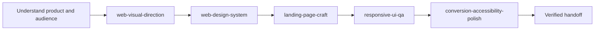

<div align="center">

# Agent Website Design Skills

**A verification-first design toolkit for AI coding agents.**

Give Codex, Claude Code, Cursor, Copilot, Gemini CLI, OpenCode, and other compatible agents stronger judgment for visual direction, design systems, landing pages, responsive QA, accessibility, and ethical conversion.

[](https://skills.sh/divyanshu-iitian/agent-website-design-skills)
[](https://github.com/divyanshu-iitian/agent-website-design-skills/actions/workflows/validate.yml)
[](https://github.com/divyanshu-iitian/agent-website-design-skills/stargazers)
[](LICENSE)

[Install](#install) · [Choose a skill](#choose-a-skill) · [Use the full workflow](#full-website-workflow) · [Contribute](CONTRIBUTING.md)

</div>

## Why this exists

AI can produce frontend code quickly. The hard part is making the result:

- specific to the product instead of a generic template;
- coherent across typography, color, layout, components, and states;
- honest and convincing without fake proof or dark patterns;
- resilient across real content, mobile widths, keyboard use, and failure states;
- verified in the browser instead of declared finished from source code alone.

These five focused skills encode that missing workflow. Each one has a clear delivery contract, one-level references, and explicit verification steps while staying small enough for an agent context window.

## Install

Install the complete collection with the open [`skills`](https://github.com/vercel-labs/skills) CLI:

```bash
npx skills add divyanshu-iitian/agent-website-design-skills
```

Install one skill globally for Codex:

```bash
npx skills add divyanshu-iitian/agent-website-design-skills \
  --skill landing-page-craft \
  --agent codex \
  --global \
  --yes
```

Try a skill without installing it:

```bash
npx skills use divyanshu-iitian/agent-website-design-skills@responsive-ui-qa
```

List everything the CLI discovers:

```bash
npx skills add divyanshu-iitian/agent-website-design-skills --list
```

<details>
<summary>Manual installation</summary>

Copy any skill folder into the skills directory used by your agent:

```bash
cp -R landing-page-craft ~/.codex/skills/
```

Windows PowerShell:

```powershell
Copy-Item -Recurse .\landing-page-craft "$env:USERPROFILE\.codex\skills\"
```

</details>

## Choose a skill

| Skill | Use it when you need | What it must deliver |
| --- | --- | --- |
| [`web-visual-direction`](web-visual-direction/SKILL.md) | A distinctive art direction before substantial implementation | Visual thesis, reference principles, direction spec, token sketch, responsive intent, proof |
| [`web-design-system`](web-design-system/SKILL.md) | Tokens and components that must become consistent and maintainable | Audit mode, semantic token map, component contracts, migration slice, verification |
| [`landing-page-craft`](landing-page-craft/SKILL.md) | A homepage, product, pricing, launch, portfolio, campaign, or waitlist page | Conversion brief, page argument, evidence map, CTA map, implemented flow, verification |
| [`responsive-ui-qa`](responsive-ui-qa/SKILL.md) | Responsive defects or final cross-viewport frontend QA | Test matrix, severity, root causes, fixes, before/after evidence, residual risk |
| [`conversion-accessibility-polish`](conversion-accessibility-polish/SKILL.md) | An existing flow needs clearer decisions, better trust, forms, and accessibility | Primary path, prioritized findings, ethical fixes, keyboard/mobile verification, honest limits |

### Quick prompts

```text
Use $web-visual-direction to define an implementation-ready direction for this product.

Use $web-design-system to reconcile the inconsistent tokens and component states in this app.

Use $landing-page-craft to redesign this homepage around a clear conversion path. Do not invent proof.

Use $responsive-ui-qa to reproduce and fix the mobile overflow, then show before/after evidence.

Use $conversion-accessibility-polish to audit this signup flow for decision clarity, keyboard access, and dark patterns.
```

## Full website workflow

Use only the stages the project needs:



Example orchestration prompt:

```text
Use $web-visual-direction to establish the concept, $web-design-system to encode it,
and $landing-page-craft to implement the page. Then use $responsive-ui-qa and
$conversion-accessibility-polish for browser evidence, keyboard checks, and the final handoff.
Preserve the existing stack and do not fabricate product claims or customer proof.
```

## Design principles

- **Product before decoration.** Show the real task, object, work, or outcome.
- **Decisions before sections.** Every screen and section should answer a user question.
- **Semantics before raw values.** Systems should encode purpose, not merely today’s color.
- **Root causes before patches.** Responsive fixes must survive adjacent widths and content stress.
- **Access before presumed lift.** Conversion work must not add deception or exclude users.
- **Evidence before “done.”** Verify critical routes, states, viewports, and input modes.

## Open and inspectable

- Skills contain Markdown instructions, YAML display metadata, and focused references.
- No skill contains executable code, telemetry, network calls, or hidden hooks.
- [`skills.json`](skills.json) exposes the catalog for tools.
- [`llms.txt`](llms.txt) provides a compact agent-readable map.
- [`AGENTS.md`](AGENTS.md) explains repository-level behavior.
- [`evals/cases.json`](evals/cases.json) defines realistic qualitative prompts and observable pass/fail signals without inventing benchmark scores.
- CI validates every skill, catalog entry, reference link, and display metadata file.

## Repository layout

```text
.
├── web-visual-direction/
├── web-design-system/
├── landing-page-craft/
├── responsive-ui-qa/
├── conversion-accessibility-polish/
├── evals/cases.json
├── scripts/validate_repo.py
├── skills.json
├── llms.txt
└── AGENTS.md
```

Each skill uses progressive disclosure:

1. `name` and `description` are available for discovery.
2. `SKILL.md` loads only when the skill matches the request.
3. `references/` loads only when the workflow points to it.

## Validate locally

```bash
python scripts/validate_repo.py
npx skills add . --list
```

The repository validator uses only the Python standard library. It checks skill frontmatter, naming, catalog synchronization, relative Markdown links, `agents/openai.yaml`, default prompt references, and eval coverage.

## Contributing

Focused improvements and realistic test cases are welcome. Read [CONTRIBUTING.md](CONTRIBUTING.md) before proposing a new skill or changing a delivery contract.

## Standards and ecosystem

The repository follows the open Agent Skills folder format and is installable through the `skills` CLI. Accessibility guidance is oriented toward [WCAG 2.2](https://www.w3.org/TR/WCAG22/), while recognizing that automated checks alone cannot establish conformance.

## License

[MIT](LICENSE) © Divyanshu Mishra.
